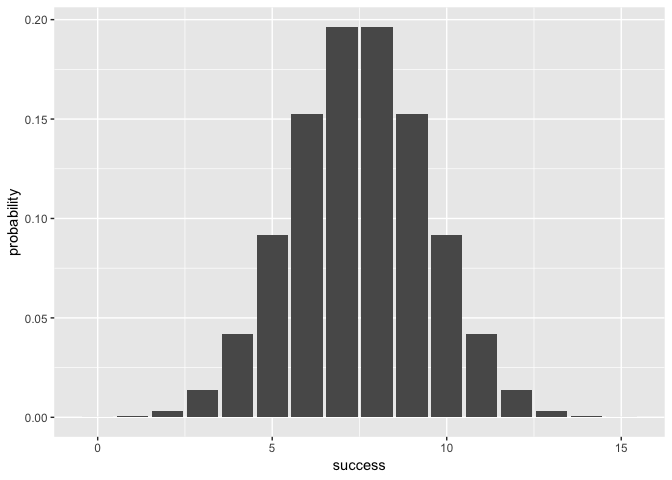

The Binomial Package
--------------------

In stats 134, we learned of the binomial distribution being a discrete probability distribution of the number of successes in n trials. It is one of the first distributions we are introduced to in statistics. This package consists of several functions that are intended to complement your knowledge of the binomial distribution by making it easy to compute several important statistics.

For example:

-   `bin_distribution()` outputs a data frame, with the number of success in one column and probability of success of a given distribution in the second column.
-   `bin_cumulative()` outputs a data frame, with the number of success in one column and the cumulative probability of success of a given distribution in the second column.

Please refer to the `vignettes` folder for additional documentation of the functions in this package.

Motivation
----------

The point of this package is to complement the learning of R packages in our Stats 133 course. There is a lot to learn from making a package, including all the behind-the-scenes work such as checker functions, auxiliary functions, and the importance of testthat.

Installation
------------

To install the `binomial` package, you must first install `"devtools"` package onto your console:

``` r
# development version from GitHub:
install.packages("devtools") 
# install "binomial" (without vignettes)
devtools::install_github("stat133-sp19/hw-stat133-andrenguyensha/tree/master/binomial")
# install "cointoss" (with vignettes)
devtools::install_github("stat133-sp19/hw-stat133-andrenguyensha/tree/master/binomial")
```

Examples of the binomial package in use
---------------------------------------

``` r
library(binomial)
#Finding the probability of 4 heads in 10 flips of a fair coin
bin_probability(success = 4, trials = 10, prob = 0.5)
#> [1] 0.2050781
#Finding the probability of 4 heads in 10 flips of a biased coin that falls on heads 30% of the time
bin_probability(success = 4, trials = 10, prob = 0.3)
#> [1] 0.2001209

#Tabulating at the entire binomial distribution of 15 flips of a fair coin
bin_distribution(trials = 15, prob = 0.5)
#> Warning in if (success != as.integer(success)) {: the condition has length
#> > 1 and only the first element will be used
#>    success  probability
#> 1        0 3.051758e-05
#> 2        1 4.577637e-04
#> 3        2 3.204346e-03
#> 4        3 1.388550e-02
#> 5        4 4.165649e-02
#> 6        5 9.164429e-02
#> 7        6 1.527405e-01
#> 8        7 1.963806e-01
#> 9        8 1.963806e-01
#> 10       9 1.527405e-01
#> 11      10 9.164429e-02
#> 12      11 4.165649e-02
#> 13      12 1.388550e-02
#> 14      13 3.204346e-03
#> 15      14 4.577637e-04
#> 16      15 3.051758e-05

#Plotting the distribution above
bindis_plot <- bin_distribution(trials =  15, prob = 0.5)
#> Warning in if (success != as.integer(success)) {: the condition has length
#> > 1 and only the first element will be used
plot(bindis_plot)
```



``` r

#Looking at the cumulative probability distribution
bin_cumulative(trials = 15, prob = 0.5)
#> Warning in if (success != as.integer(success)) {: the condition has length
#> > 1 and only the first element will be used
#>    success  probability   cumulative
#> 1        0 3.051758e-05 3.051758e-05
#> 2        1 4.577637e-04 4.882812e-04
#> 3        2 3.204346e-03 3.692627e-03
#> 4        3 1.388550e-02 1.757812e-02
#> 5        4 4.165649e-02 5.923462e-02
#> 6        5 9.164429e-02 1.508789e-01
#> 7        6 1.527405e-01 3.036194e-01
#> 8        7 1.963806e-01 5.000000e-01
#> 9        8 1.963806e-01 6.963806e-01
#> 10       9 1.527405e-01 8.491211e-01
#> 11      10 9.164429e-02 9.407654e-01
#> 12      11 4.165649e-02 9.824219e-01
#> 13      12 1.388550e-02 9.963074e-01
#> 14      13 3.204346e-03 9.995117e-01
#> 15      14 4.577637e-04 9.999695e-01
#> 16      15 3.051758e-05 1.000000e+00
#Binomial RV
bin_variable(trials = 15, prob = 0.5)
#> "Binomial Variable"
#> 
#> Parameters
#> 
#> number of trials: 15 
#> prob of success: 0.5
#Full Summary Statistics of the Binomial RV
bin_summary <- bin_variable(trials = 15, prob = 0.5)
summary(bin_summary)
#> 'Summary Binomial'
#> 
#> Parameters:
#> - number of trials      : 15 
#> - probability of success: 0.5 
#> 
#> Measures:
#> - mean    : 7.5 
#> - variance: 3.75 
#> - mode(s) : 8 
#> - skewness: 0 
#> - kurtosis: -0.1333333
```
