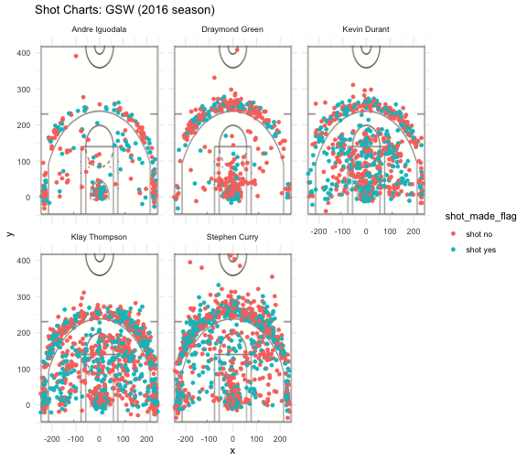

workout01-andre-sha
================
Andre Sha
3/11/2019

``` r
library(dplyr)
```

    ## 
    ## Attaching package: 'dplyr'

    ## The following objects are masked from 'package:stats':
    ## 
    ##     filter, lag

    ## The following objects are masked from 'package:base':
    ## 
    ##     intersect, setdiff, setequal, union

``` r
library(ggplot2)
library(grid)
library(jpeg)
library(tidyr)
library(knitr)
```

``` r
data_types = c("team_name"="character", "game_date"="character", "season" = "integer", "period"="integer",
               "minutes_remaining"="integer", "seconds_remaining"="integer", "shot_made_flag"="character",
               "action_type"="factor", "shot_type"="factor", "shot_distance"="integer", "opponent"="character",
               "x"="integer", "y"="integer")
allplayers <- read.csv('../data/shots-data.csv', stringsAsFactors = FALSE, colClasses = data_types)
```

``` r
twopointers <- allplayers[allplayers$shot_type == "2PT Field Goal", ]
threepointers <- allplayers[allplayers$shot_type == "3PT Field Goal", ]
#n() is the number of observations in the group

twopointers %>%
  group_by(name) %>%
  summarise(total = n(),
            made = sum(shot_made_flag=="shot yes")) %>%
  mutate(perc_made = made/total) %>%
  arrange(desc(perc_made))
```

    ## # A tibble: 5 x 4
    ##   name           total  made perc_made
    ##   <chr>          <int> <int>     <dbl>
    ## 1 Andre Iguodala   210   134     0.638
    ## 2 Kevin Durant     643   390     0.607
    ## 3 Stephen Curry    563   304     0.540
    ## 4 Klay Thompson    640   329     0.514
    ## 5 Draymond Green   346   171     0.494

``` r
threepointers %>%
  group_by(name) %>%
  summarise(total = n(),
            made = sum(shot_made_flag=="shot yes")) %>%
  mutate(perc_made = made/total) %>%
  arrange(desc(perc_made))
```

    ## # A tibble: 5 x 4
    ##   name           total  made perc_made
    ##   <chr>          <int> <int>     <dbl>
    ## 1 Klay Thompson    580   246     0.424
    ## 2 Stephen Curry    687   280     0.408
    ## 3 Kevin Durant     272   105     0.386
    ## 4 Andre Iguodala   161    58     0.360
    ## 5 Draymond Green   232    74     0.319

``` r
allplayers %>%
  group_by(name) %>%
  summarise(total = n(),
            made = sum(shot_made_flag=="shot yes")) %>%
  mutate(perc_made = made/total) %>%
  arrange(desc(perc_made))
```

    ## # A tibble: 5 x 4
    ##   name           total  made perc_made
    ##   <chr>          <int> <int>     <dbl>
    ## 1 Kevin Durant     915   495     0.541
    ## 2 Andre Iguodala   371   192     0.518
    ## 3 Klay Thompson   1220   575     0.471
    ## 4 Stephen Curry   1250   584     0.467
    ## 5 Draymond Green   578   245     0.424



Introduction.
=============

Are you a fan of basketball? Are you a fan of data analyzing? If so, then you would love this workout! This project, coined as "Workout 01: GSW Shot Charts", is meant as an introduction to working with complex file structures. Through this project, I learned the basics of operating GitHub as well as manipulating data to create aesthetically pleasing visual aids for those interested in Basketball or sports analytics. This project also gave a hands-on experience with writing statistical reports and interpreting data charts.

Motivation.
===========

As a student in Prof. Gaston Sanchez's Stat 133 course as well as a huge sports fan, I was really excited to work on this project. Although it took a really long time to compile everything together, it was well worth it. As a Bay Area native, I've been a huge fan of the Golden State Warriors ever since I was a young kid. I hope to have a future in either becoming a data scientist in tech or trying my shot (no pun intended) as a sports data analyst for ESPN, the NHL (National Hockey League), and the NFL.

Background.
===========

 The Golden State Warriors are a professional basketball franchise based in Oakland, California. GSW saw itself rise in massive popularity or infamy amongst basketball fans during the Steve Kerr era from 2014-present, in which head coach Steve Kerr led the Warriors to championship wins in 2014-15, 2016-17, and 2017-2018.
